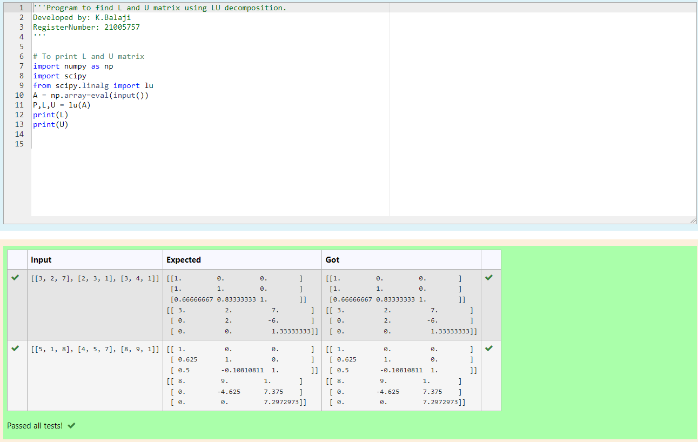
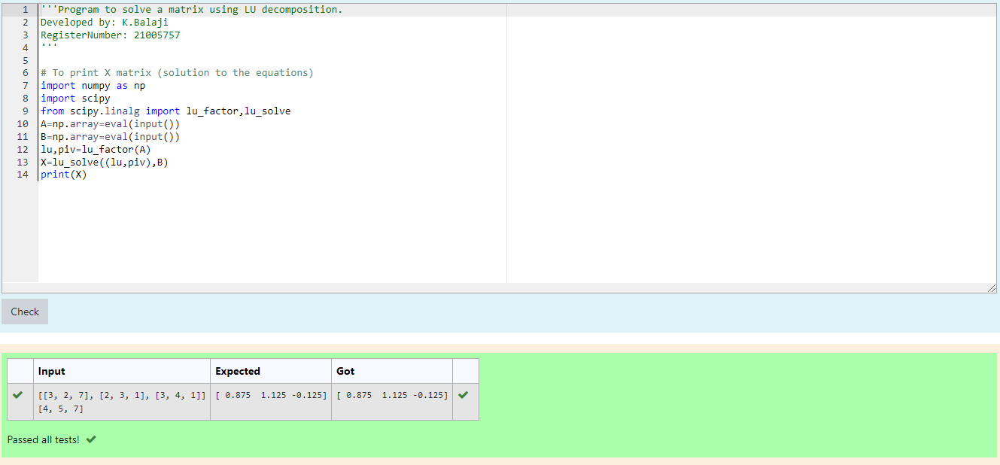

# LU Decomposition without zero on the diagonal

## AIM:
To write a program to find the LU Decomposition of a matrix.

## Equipments Required:
1. Hardware – PCs
2. Anaconda – Python 3.7 Installation / Moodle-Code Runner

## Algorithm
1. Import numpy and scipy from python library
2. Get input from user
3. Calculate lu product and decomposition of the given matrices
4. Print the result

## Program:
```
/*
Program to find the LU Decomposition of a matrix.
Developed by: K.Balaji
RegisterNumber: 21005757

# To print L and U matrix
import numpy as np
import scipy
from scipy.linalg import lu
A = np.array=eval(input())
P,L,U = lu(A)
print(L)
print(U)

# To print X matrix (solution to the equations)
import numpy as np
import scipy
from scipy.linalg import lu_factor,lu_solve
A=np.array=eval(input())
B=np.array=eval(input())
lu,piv=lu_factor(A)
X=lu_solve((lu,piv),B)
print(X)
*/
```

## Output1:

## Output2:



## Result:
Thus the program to find the LU Decomposition of a matrix is written and verified using python programming.

